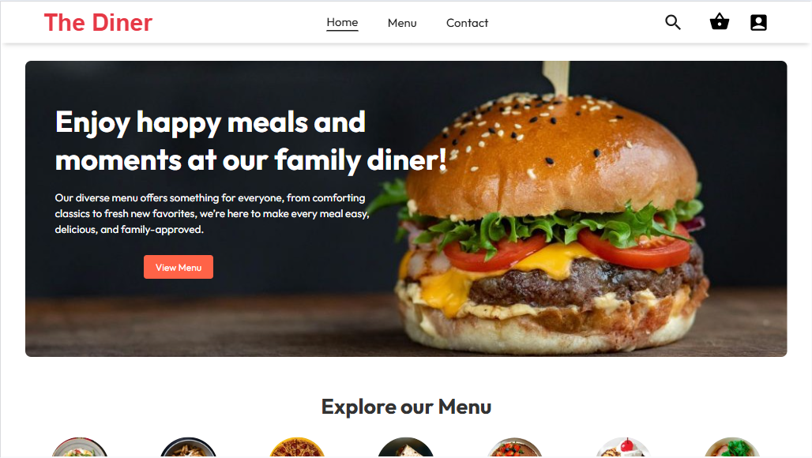

# TheDiner — E‑commerce React App

A small, component-driven e‑commerce demo built with React and Vite. This repository contains a frontend for a restaurant-style store called "TheDiner" showcasing product lists, a cart, and a simple checkout flow.

## Key features

- Component-based React UI (menu, product items, cart, order flow)
- Client-side routing with React Router
- UI built with plain CSS modules and Material UI icons where needed
- Fast dev experience using Vite

## Tech stack

- React 19
- Vite
- React Router
- Material UI (icons + core)
- Tailwind (dev dependency present) and PostCSS

## Live Demo
[https://name.thediner.app](https://name.thediner.app)

## Demo

## License

This project is available under the MIT License(License). 

